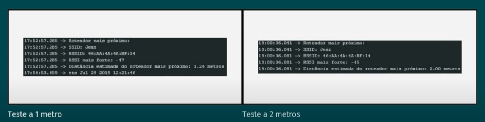
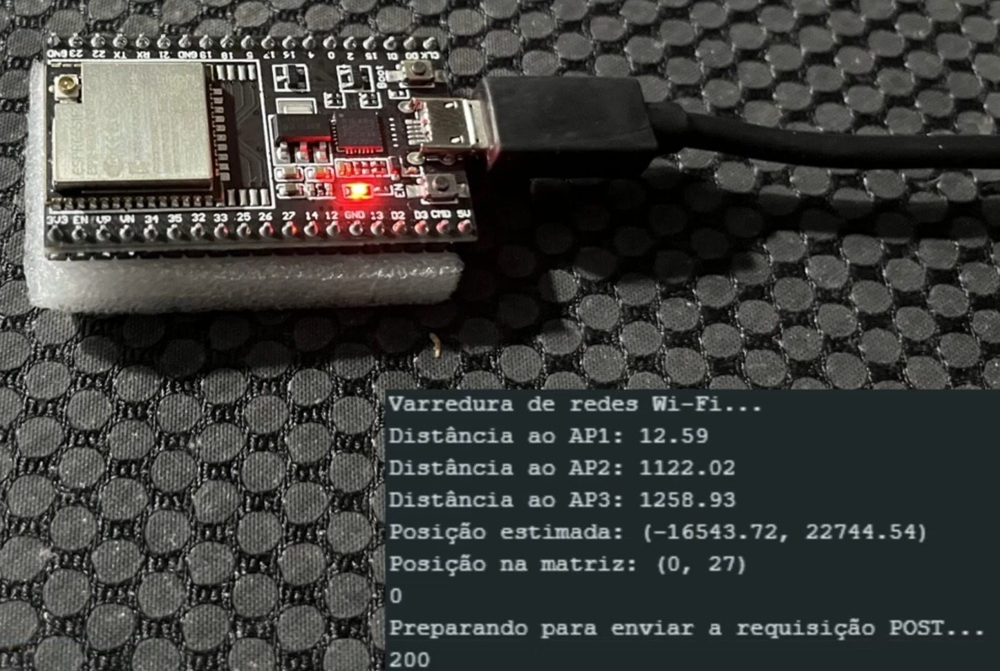

# Projeto-IoT-Localizacao-do-Carrinho-Plataforma

 Desenvolvemos uma solução de localização para rebocadores da John Deere usando triangulação Wi-Fi com ESP32. Através da leitura de sinais de pontos de acesso Wi-Fi, a posição dos veículos é determinada em tempo real, permitindo monitoramento eficiente via interface web, otimização de rotas e aumento da produtividade nas operações da fábrica.
# Desenvolvimento
 # Arquitetura do Sistema
  A arquitetura proposta foi elaborada com base em um sistema IoT, onde o ESP32 atua como o elemento central para coleta e envio dos dados de localização. A comunicação ocorre via rede Wi-Fi, e os dados são processados por um servidor local ou na nuvem.
  
 
 # Componentes principais:
  ESP32: Dispositivo principal responsável por coletar os dados de localização do carrinho.
  Servidor de Processamento: Hospeda o sistema de triangulação de sinal Wi-Fi e processa os dados de localização.
  Dashboard (Web App): Interface para visualização em tempo real da posição do carrinho.
# Tecnologias Utilizadas
 ESP32: Controlador Wi-Fi para leitura de dados e envio para o servidor.
 WebSocket: Comunicação em tempo real entre o ESP32 e o servidor.
 HTML/CSS/JS: Interface web para visualização dos dados.
 Draw.io: Ferramenta utilizada para a criação do diagrama da arquitetura.
 GitHub: Controle de versão e portfólio do projeto.
# Funcionamento
 # Pedido de peças feito
 
 
 
 # Carrinho indo entregar as peças 
 
 
 

# Feito a entrega, volta para o estoque

 
 
 O sistema utiliza triangulação de sinal Wi-Fi, onde o ESP32 coleta o RSSI (Received Signal Strength Indicator) de diferentes roteadores Wi-Fi para estimar a posição do carrinho plataforma. Esses dados são enviados ao servidor, que calcula a posição exata e exibe na dashboard.
# Testes de Desempenho:
  Localização precisa em tempo real.
  Visualização clara da posição do carrinho na fábrica.
  
 # 1. Teste de Precisão de Localização: 
  Realizamos o teste de precisão de localização com o objetivo de verificar a proximidade entre a posição real e a posição calculada pelo sistema de triangulação de WiFi. Os testes foram realizados em um ambiente com baixa interferência de sinal, posicionado o dispositivo ESP32 a distâncias de 1 metro e 2 metros dos pontos de referência.
  
 Resultados Obtidos:
 Observamos uma variação média de 60 cm entre a posição calculada e a posição real em ambas as distâncias. Essa discrepância mostra que, mesmo em um ambiente controlado e de baixa interferência, o sistema ainda apresenta limitações em relação à precisão. Esse valor pode ser influenciado pela potência do sinal WiFi, a sensibilidade do ESP32 e o método de triangulação utilizado.
 
# 2. Teste de Estabilidade de Sinal:
  O teste de estabilidade foi realizado simultaneamente com o teste de precisão, para observar a consistência do sinal em condições de baixa interferência. Monitoramos a conexão do ESP32 e verificamos a taxa de perda de pacotes e eventuais quedas de conexão ao longo do processo.

  Resultados Obtidos:
  Em ambientes com baixa interferência, o sinal se manteve estável, sem quedas significativas. A taxa de perda de pacotes foi mínima, indicando que o sistema é confiável nesse tipo de ambiente.
   
 Discussão dos Resultados:
  Os testes indicam que o sistema possui uma boa estabilidade em condições de baixa interferência, mas a precisão da localização ainda tem margem para melhoria. A variação de 60 cm, apesar de aceitável em alguns cenários, pode impactar negativamente em contextos onde uma precisão mais rigorosa é necessária.

 Soluções Futuras:
  Para reduzir a variação observada, podemos considerar o uso de algoritmos de filtragem de sinal, como o filtro de Kalman, ou o aumento da densidade dos pontos de referência para melhorar a precisão da triangulação. Além disso, o uso de antenas específicas e otimizações no código de triangulação podem ajudar a melhorar a precisão de localização.

# Teste de Estabilidade de Sinal
a) Definição do Teste
 Durante os testes de estabilidade do sinal WiFi com o ESP32, observamos que, em um ambiente com interferência de 2.2 (baixa interferência), a intensidade média do sinal estabilizou em um valor fixo de -45 dBm. Esse resultado indica que, mesmo com a presença de interferência, o dispositivo conseguiu manter uma qualidade de sinal robusta.

 Em nossos testes, notamos que, a cada metro de distância, havia uma perda média de cerca de 2dBm. Isso significa que, em ambientes com alta interferência, a intensidade do sinal pode ser mais afetada. No entanto, o valor fixo de -45 dBm demonstra que o sistema é capaz de se adaptar e manter uma conexão estável.

 Essas medições são cruciais para entender o comportamento do ESP32 em condições de interferência, ajudando a definir os limites operacionais do dispositivo. Além disso, fornecem insights sobre como otimizar a implementação em cenários desafiadores. A manutenção de um sinal em -45 dBm, mesmo em um ambiente com baixa interferência, é um indicativo positivo da capacidade do sistema em garantir comunicação eficiente, embora com limitações na precisão de localização.

# b) Evidências de Testes
 O teste foi realizado em um ambiente de baixa interferência. Observamos a taxa de transmissão de pacotes e a estabilidade da conexão ao longo do teste.

Capturas de Tela: Abaixo, apresentamos algumas evidências que demonstram o comportamento do sinal. As capturas mostram a taxa de transmissão e os pacotes recebidos em intervalos regulares, além de indicar qualquer perda de pacotes.

# c) Discussão dos Resultados
 Os resultados mostraram que, em um ambiente com baixa interferência, o ESP32 conseguiu manter uma conexão estável, com uma taxa mínima de perda de pacotes. Isso indica que, para ambientes semelhantes ao dos testes, o sistema é confiável e apresenta uma boa performance de conexão. No entanto, em ambientes de maior interferência, pode ser necessário realizar ajustes para garantir a estabilidade do sinal.

# d) Soluções Futuras
 Para melhorar a estabilidade do sinal em ambientes mais desafiadores, consideramos algumas soluções futuras:

Ajuste de Potência de Sinal: Aumentar a potência de sinal do ESP32 para reduzir a perda de pacotes em locais com interferência.
Filtro de Pacotes: Implementar um filtro de pacotes no código do ESP32, que possa descartar pacotes corrompidos, assegurando maior qualidade dos dados recebidos.
Implementação de Algoritmos de Correção de Sinal: O uso de algoritmos como o filtro de Kalman pode ajudar a suavizar as variações do sinal e melhorar a precisão e estabilidade da comunicação.
Essas melhorias visam fortalecer a consistência e a confiabilidade do sistema de rastreamento, permitindo melhor performance em uma variedade de ambientes.

